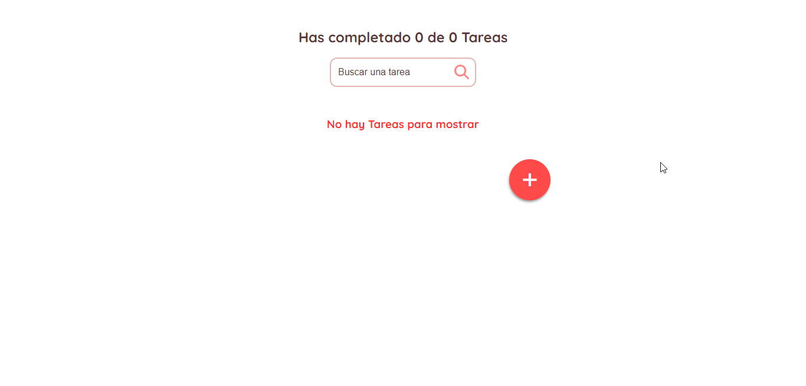
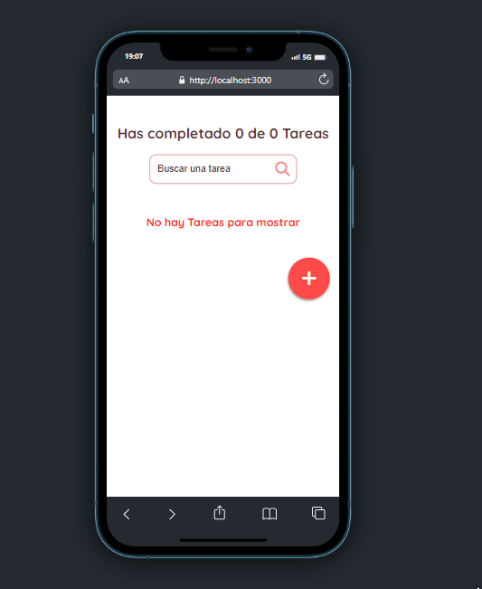

# Todo List App

An App that creates a list of tasks which you can create, marks as completed, search and delete tasks, which will be stored in your local storage to persist the data.

You can try it in the following urls

|-> [Todo List App Github Pages](https://klich1984.github.io/todo-list-react/)

|-> [Todo List App Netlify](https://klich-todolist.netlify.app/)

## Views

### desktop

### Mobile

# Getting Started with Create React App

This project was bootstrapped with [Create React App](https://github.com/facebook/create-react-app).
